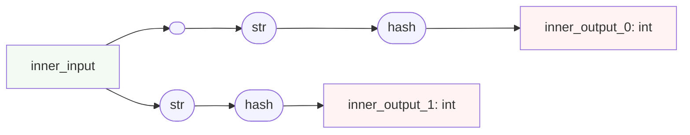
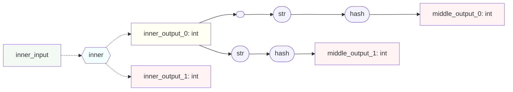
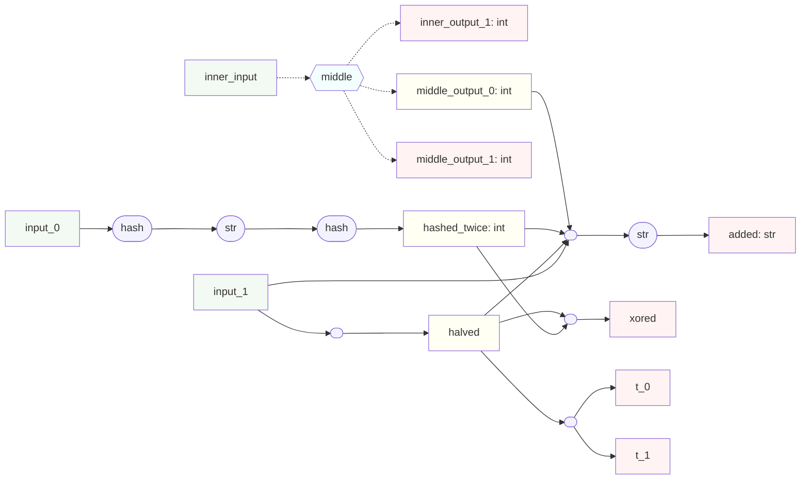

# inner_graph.build()

```mermaid
graph LR

  %% Subgraph Edges

  %% Top Level Edges
  dn_inner_input["inner_input"]:::ks --> f_0_0(["<lambda>"]):::fs
  f_0_0 --> f_0_1(["str"]):::fs
  f_0_1 --> f_0_2(["hash"]):::fs
  f_0_2 --> dn_inner_output_0["inner_output_0: int"]:::ts
  dn_inner_input --> f_1_0(["str"]):::fs
  f_1_0 --> f_1_1(["hash"]):::fs
  f_1_1 --> dn_inner_output_1["inner_output_1: int"]:::ts

  %% Styling
  classDef ks fill:#0080000c;
  classDef is fill:#ffff000c;
  classDef ts fill:#ff00000c;
  classDef ss fill:#00ffff0c;
  classDef fs fill:#0000ff0c;
  classDef rs fill:#ff00007f;
```

# middle_graph.build()

```mermaid
graph LR

  %% Subgraph Edges
  dn_inner_input["inner_input"]:::ks -.-> sg_inner{{"inner"}}:::ss
  sg_inner -.-> dn_inner_output_0["inner_output_0: int"]:::is
  sg_inner -.-> dn_inner_output_1["inner_output_1: int"]:::ts

  %% Top Level Edges
  dn_inner_output_0 --> f_2_0(["<lambda>"]):::fs
  f_2_0 --> f_2_1(["str"]):::fs
  f_2_1 --> f_2_2(["hash"]):::fs
  f_2_2 --> dn_middle_output_0["middle_output_0: int"]:::ts
  dn_inner_output_0 --> f_3_0(["str"]):::fs
  f_3_0 --> f_3_1(["hash"]):::fs
  f_3_1 --> dn_middle_output_1["middle_output_1: int"]:::ts

  %% Styling
  classDef ks fill:#0080000c;
  classDef is fill:#ffff000c;
  classDef ts fill:#ff00000c;
  classDef ss fill:#00ffff0c;
  classDef fs fill:#0000ff0c;
  classDef rs fill:#ff00007f;
```

# graph_with_subgraphs

```mermaid
graph LR

  %% Subgraph Edges
  dn_inner_input["inner_input"]:::ks -.-> sg_middle{{"middle"}}:::ss
  sg_middle -.-> dn_inner_output_1["inner_output_1: int"]:::ts
  sg_middle -.-> dn_middle_output_0["middle_output_0: int"]:::is
  sg_middle -.-> dn_middle_output_1["middle_output_1: int"]:::ts

  %% Top Level Edges
  dn_input_0["input_0"]:::ks --> f_4_0(["hash"]):::fs
  f_4_0 --> f_4_1(["str"]):::fs
  f_4_1 --> f_4_2(["hash"]):::fs
  f_4_2 --> dn_hashed_twice["hashed_twice: int"]:::is
  dn_input_1["input_1"]:::ks --> f_5_0(["<lambda>"]):::fs
  f_5_0 --> dn_halved["halved"]:::is
  dn_middle_output_0 --> f_6_0(["<lambda>"]):::fs
  dn_hashed_twice --> f_6_0
  dn_halved --> f_6_0
  dn_input_1 --> f_6_0
  f_6_0 --> f_6_1(["str"]):::fs
  f_6_1 --> dn_added["added: str"]:::ts
  dn_halved --> f_7_0(["<lambda>"]):::fs
  dn_hashed_twice --> f_7_0
  f_7_0 --> dn_xored["xored"]:::ts
  dn_halved --> f_8_0(["<lambda>"]):::fs
  f_8_0 --> dn_t_0["t_0"]:::ts
  f_8_0 --> dn_t_1["t_1"]:::ts

  %% Styling
  classDef ks fill:#0080000c;
  classDef is fill:#ffff000c;
  classDef ts fill:#ff00000c;
  classDef ss fill:#00ffff0c;
  classDef fs fill:#0000ff0c;
  classDef rs fill:#ff00007f;
```

